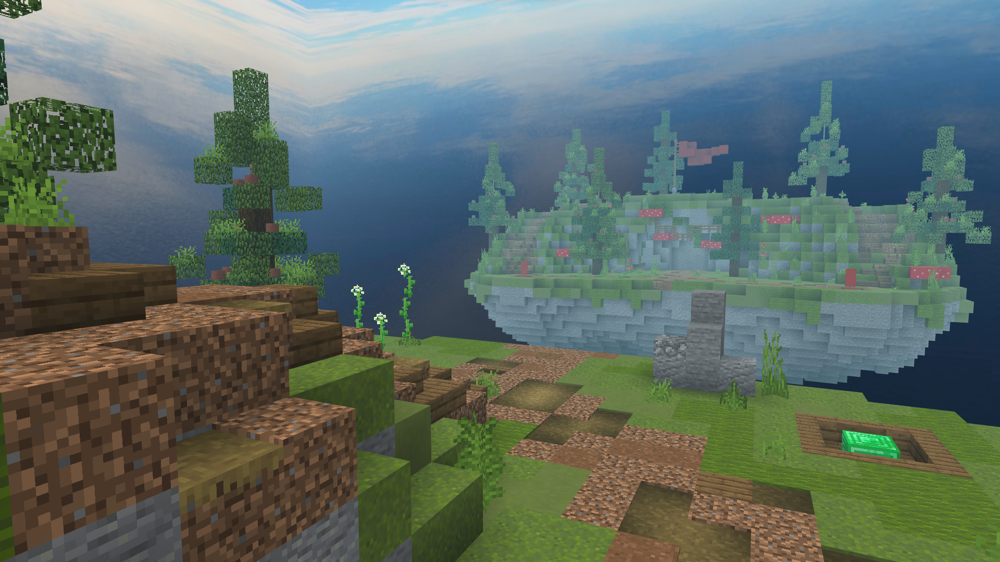
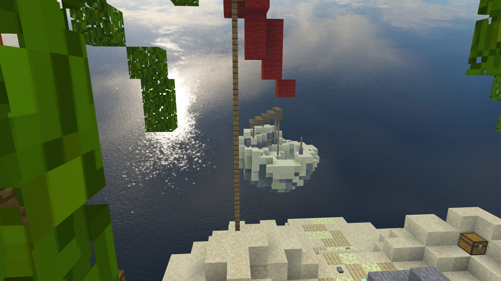
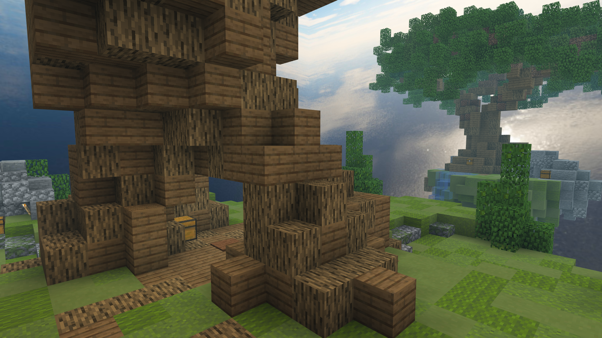
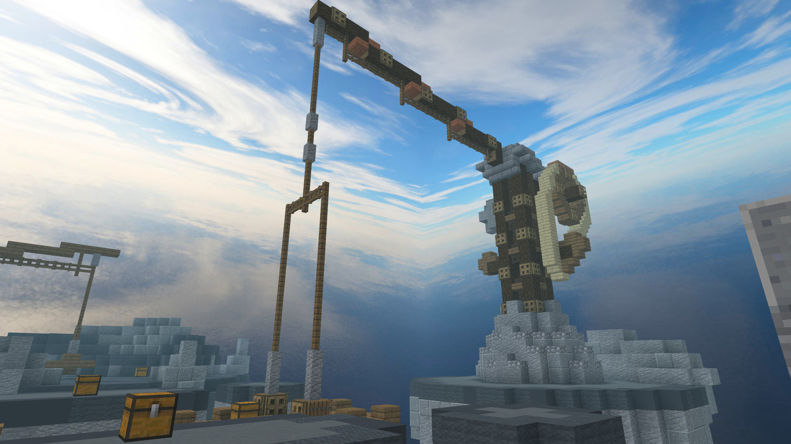
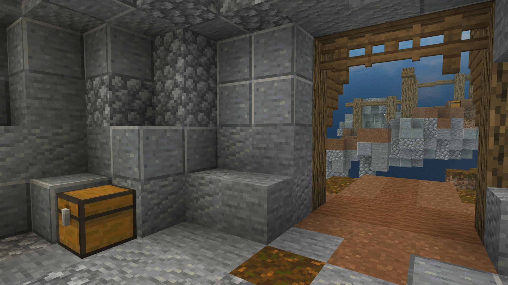
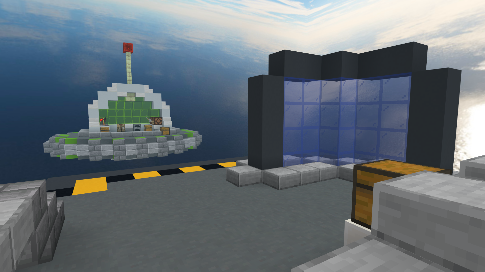

# Map Rotation

::: info PLEASE NOTE
Maps rotate every **3 months**. This support thread will be updated by maps in the rotation when a new rotation starts.
:::

## Introduction

The map rotation is a system NetherGames has in place to keep maps fresh and different. Maps are hand-picked by the Game Design team every three months based on community feedback and the season.

The OCTOBER ROTATION is taking place in the FESTIVE SEASON, bringing in many revamps and changes to existing maps you already know and love. This is also the first season where different maps would be set on either day... or night... for increased variety.

This is a list of all currently rotated maps for all gamemodes in the program.

## Quick Access

[Bedwars](#bedwars)

[Conquests](#conquests)

[Murder Mystery](#murder-mystery)

[Skywars](#skywars)

[The Bridge](#the-bridge)

[Duels](#duels)

## Bedwars

### Solo/Duos
<figure>
    <figcaption>Candyland</figcaption>
    
</figure>
<figure>
    <figcaption>Catamaran (SPOOKIFIED)</figcaption>
    
<figure>
    <figcaption>Celestial</figcaption>
    
</figure>
<figure>
    <figcaption>Cloud</figcaption>
    
</figure>
<figure>
    <figcaption>Dynasty (NEW)</figcaption>
    
</figure>
<figure>
    <figcaption>Giants</figcaption>
    
</figure>
<figure>
    <figcaption>Pandora</figcaption>
    
</figure>
<figure>
    <figcaption>Royal</figcaption>
    
</figure>
<figure>
    <figcaption>Shrooms (REVAMPED)</figcaption>
    
</figure>
<figure>
    <figcaption>Stonehenge</figcaption>
    
</figure>
    
<figure>
    <figcaption>Sultry (SEASONAL)</figcaption>
    
</figure>

<figure>
    <figcaption>Undying (SPOOKIFIED)</figcaption>
    
</figure>

<figure>
    <figcaption>Wilderness (SPOOKIFIED)</figcaption>
    
</figure>

### Squads
<figure>
    <figcaption>Elementar</figcaption>
    
</figure>
<figure>
    <figcaption>Fungal</figcaption>
    
<figure>
    <figcaption>Giants</figcaption>
    
</figure>
<figure>
    <figcaption>Nexus</figcaption>
    
</figure>
<figure>
    <figcaption>Perplexion</figcaption>
    
</figure>
<figure>
    <figcaption>Primus (NEW)</figcaption>
    
</figure>
<figure>
    <figcaption>Scarecrow</figcaption>
    
</figure>
<figure>
    <figcaption>Wildwest</figcaption>
    
</figure>

## Conquests
<figure>
    <figcaption>Antiques</figcaption>
    
</figure>
<figure>
    <figcaption>Prey</figcaption>
    
</figure>
<figure>
    <figcaption>Toluca</figcaption>
    
</figure>
<figure>
    <figcaption>Woodlands</figcaption>
    
</figure>

## Murder Mystery
<figure>
    <figcaption>Academy</figcaption>
    
</figure>
<figure>
    <figcaption>Arid (NEW)</figcaption>
    
</figure>
<figure>
    <figcaption>Asylum</figcaption>
    
</figure>
<figure>
    <figcaption>Haven</figcaption>
    
</figure>
<figure>
    <figcaption>Mall</figcaption>
    
</figure>
<figure>
    <figcaption>Rome (NEW)</figcaption>
    
</figure>

## Skywars

### Regular
<figure>
    <figcaption>Bonsai</figcaption>
    
</figure>
<figure>
    <figcaption>Construction</figcaption>
    
</figure>
<figure>
    <figcaption>District</figcaption>
    
</figure>
<figure>
    <figcaption>Doughnut (NEW)</figcaption>
    
</figure>
<figure>
    <figcaption>Elowen</figcaption>
    
</figure>
<figure>
    <figcaption>Hades</figcaption>
    
</figure>
<figure>
    <figcaption>Ingress</figcaption>
    
</figure>
<figure>
    <figcaption>Jura (NEW)</figcaption>
    
</figure>
<figure>
    <figcaption>Mines</figcaption>
    
</figure>
<figure>
    <figcaption>Seafloor</figcaption>
    
</figure>
<figure>
    <figcaption>Summer</figcaption>
    
</figure>
<figure>
    <figcaption>Swale</figcaption>
    
</figure>
<figure>
    <figcaption>Sweets</figcaption>
    
</figure>
<figure>
    <figcaption>Toys</figcaption>
    
</figure>
<figure>
    <figcaption>Western</figcaption>
    
</figure>

### Duels (SW)
<figure>
    <figcaption>Burried</figcaption>
    
</figure>
<figure>
    <figcaption>Narra</figcaption>
    
</figure>
<figure>
    <figcaption>Scaffolds</figcaption>
    
</figure>
<figure>
    <figcaption>Shafts</figcaption>
    
</figure>
<figure>
    <figcaption>Solar</figcaption>
    
</figure>

## The Bridge
<figure>
    <figcaption>Ash</figcaption>
    
</figure>
<figure>
    <figcaption>Castle (SPOOKIFIED)</figcaption>
    
</figure>
<figure>
    <figcaption>Crossbones</figcaption>
    
</figure>
<figure>
    <figcaption>Frostbite</figcaption>
    
</figure>
<figure>
    <figcaption>Kraken</figcaption>
    
</figure>
<figure>
    <figcaption>Pirates (REVAMPED)</figcaption>
    
</figure>
<figure>
    <figcaption>Tabernacle (NEW)</figcaption>
    
</figure>
<figure>
    <figcaption>Wonderland</figcaption>
    
</figure>

## Duels
<figure>
    <figcaption>Entryway</figcaption>
    
</figure>
<figure>
    <figcaption>Familiar</figcaption>
    
</figure>
<figure>
    <figcaption>Meadow</figcaption>
    
</figure>
<figure>
    <figcaption>Mindgames</figcaption>
    
</figure>
<figure>
    <figcaption>Nature</figcaption>
    
</figure>
<figure>
    <figcaption>Oriental</figcaption>
    
</figure>
<figure>
    <figcaption>Paradise</figcaption>
    
</figure>
<figure>
    <figcaption>Spaceport</figcaption>
    
</figure>
